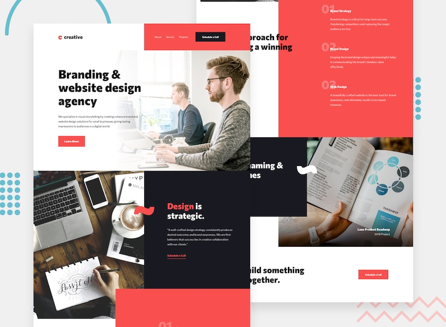

# Frontend Mentor - Creative agency single page site solution

This is a solution to the [Creative agency single page site challenge on Frontend Mentor](https://www.frontendmentor.io/challenges/creative-agency-singlepage-site-Pq6V3I2RM). Frontend Mentor challenges help you improve your coding skills by building realistic projects.

## Table of contents

- [Overview](#overview)
  - [The challenge](#the-challenge)
  - [Screenshot](#screenshot)
  - [Links](#links)
- [My process](#my-process)
  - [Built with](#built-with)
- [Author](#author)

## Overview

### The challenge

Users should be able to:

- View the optimal layout for the site depending on their device's screen size
- See hover states for all interactive elements on the page
- Navigate the slider using either their mouse/trackpad or keyboard

### Screenshot

### Links

- Solution URL: [Solution page](https://www.frontendmentor.io/solutions/create-single-page-css-grid-flexbox-and-custom-js-slider-gekskE1ww)
- Live Site URL: [Live site](https://ccreusat-creative-single-page.netlify.app/)

## My process

### Built with

- Semantic HTML5 markup
- CSS custom properties
- SCSS
- Flexbox
- CSS Grid
- Mobile-first workflow
- Vanilla JS

## Author

- Website - [Clement Creusat](https://github.com/ccreusat)
- Frontend Mentor - [@ccreusat](https://www.frontendmentor.io/profile/ccreusat)
