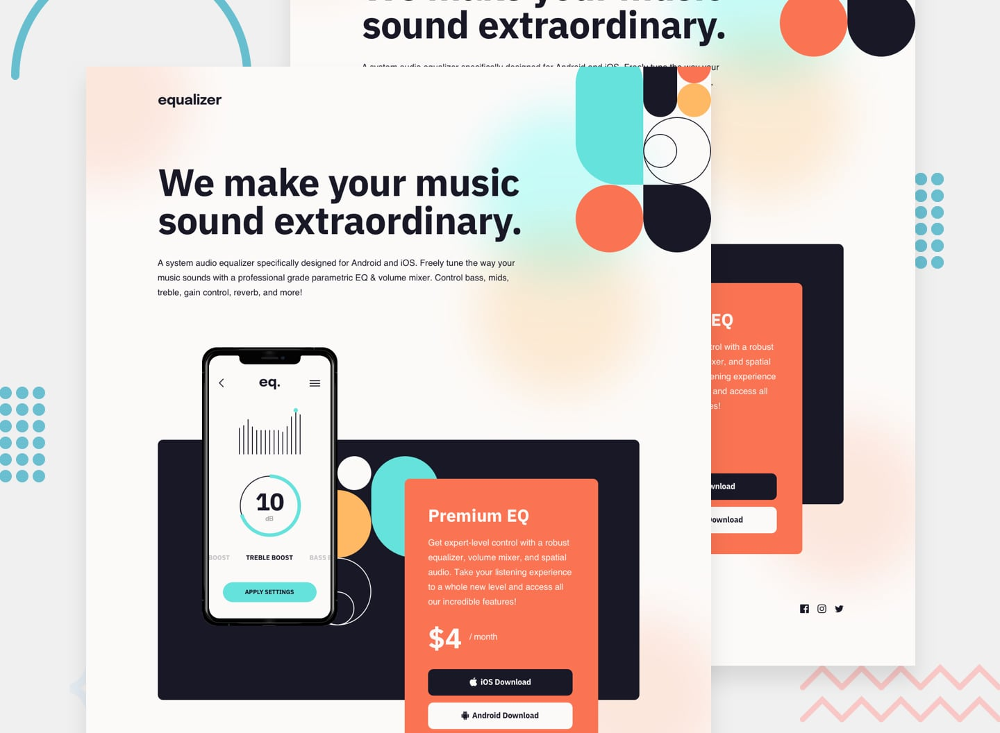

# Frontend Mentor - Equalizer landing page solution

This is a solution to the [Equalizer landing page challenge on Frontend Mentor](https://www.frontendmentor.io/challenges/equalizer-landing-page-7VJ4gp3DE). Frontend Mentor challenges help you improve your coding skills by building realistic projects.

## Table of contents

- [Overview](#overview)
  - [The challenge](#the-challenge)
  - [Screenshot](#screenshot)
  - [Links](#links)
- [My process](#my-process)
  - [Built with](#built-with)
  - [Continued development](#continued-development)
- [Author](#author)

## Overview

### The challenge

Users should be able to:

- View the optimal layout depending on their device's screen size
- See hover states for interactive elements

### Screenshot

### Links

- Solution URL: [Solution Page](https://www.frontendmentor.io/solutions/equalizer-page-with-gatsby-react-scss-design-system-coded-L4BrurYSXX)
- Live Site URL: [Live site](https://ccreusat-equalizer-landing-page.netlify.app/)

## My process

### Built with

- Semantic HTML5 markup
- CSS custom properties
- Flexbox
- CSS Grid
- Mobile-first workflow
- [Gatsby](https://www.gatsbyjs.com/)

### Continued development

I really want to learn one of these Headless CMS (Sanity, Contentful) and plug them with Gatsby.

## Author

- Website - [Clement Creusat](https://www.clement-creusat.com)
- Frontend Mentor - [@ccreusat](https://www.frontendmentor.io/profile/ccreusat)
- Github - [@ccreusat](https:/github.com/ccreusat)
