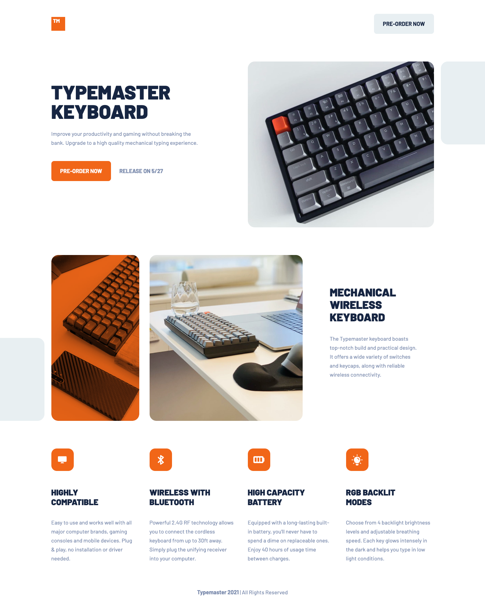

# Frontend Mentor - Typemaster pre-launch landing page solution

This is a solution to the [Typemaster pre-launch landing page challenge on Frontend Mentor](). Frontend Mentor challenges help you improve your coding skills by building realistic projects.

## Table of contents

- [Frontend Mentor - Typemaster pre-launch landing page solution](#frontend-mentor---typemaster-pre-launch-landing-page-solution)
  - [Table of contents](#table-of-contents)
  - [Overview](#overview)
    - [The challenge](#the-challenge)
    - [Screenshot](#screenshot)
    - [Links](#links)
  - [My process](#my-process)
    - [Built with](#built-with)
    - [What I learned](#what-i-learned)
    - [Continued development](#continued-development)
    - [Useful resources](#useful-resources)
  - [Author](#author)
  - [Acknowledgments](#acknowledgments)

**Note: Delete this note and update the table of contents based on what sections you keep.**

## Overview

### The challenge

Users should be able to:

- View the optimal layout depending on their device's screen size
- See hover states for interactive elements

### Screenshot



### Links

- Solution URL: [Solution page](https://www.frontendmentor.io/solutions/typemaster-landing-page-with-css-grid-and-flexbox-Jw8C-0urY)
- Live Site URL: [Live site](https://ccreusat-typemaster-landing-page.netlify.app/)

## My process

### Built with

- Semantic HTML5 markup
- CSS custom properties
- Flexbox
- CSS Grid
- Mobile-first workflow

### What I learned

Use of the picture tag to change image source.

```html
<picture>
  <source
    media="(min-width:1110px)"
    srcset="/assets/desktop/image-phone-and-keyboard.jpg"
  />
  <source
    media="(min-width:768px)"
    srcset="/assets/tablet/image-phone-and-keyboard.jpg"
  />
  
</picture>
```

### Continued development

Will change the px units in rem units.

## Author

- Github - [Clement Creusat](https://github.com/ccreusat)
- Frontend Mentor - [@ccreusat](https://www.frontendmentor.io/profile/ccreusat)
